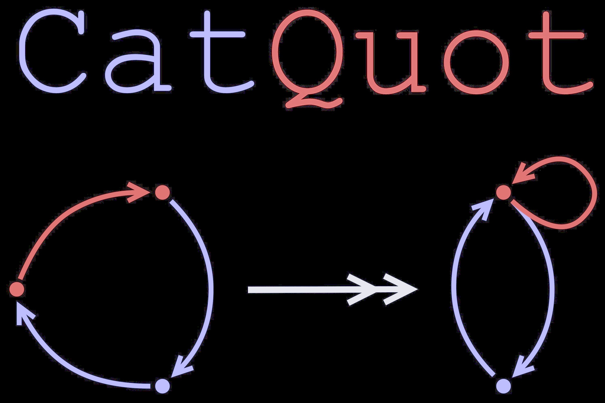
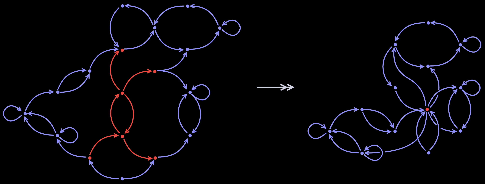
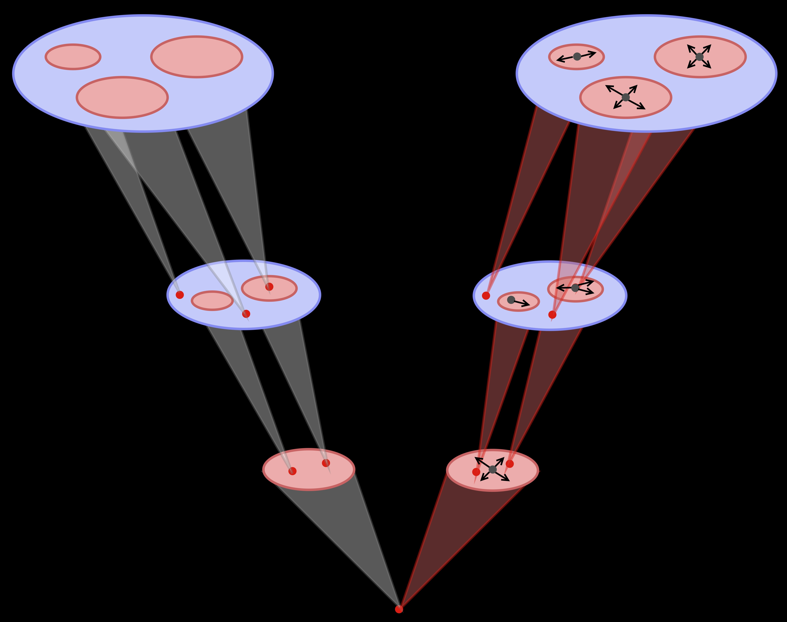

  <picture>
    <source srcset="docs/images/catquot_logo_dark.jpg" media="(prefers-color-scheme: dark)">
    <source srcset="docs/images/catquot_logo_light.jpg" media="(prefers-color-scheme: light)">
    
  </picture>

# CatQuot: Graph ML as Categorical ML
Package for HNSW-style searching in Haskell categories using a tower of quotient categories. Inspired by Abdul Malik's PhD thesis.

# TODOs
- Build `QuotTower` subpackage.
  - Build single level-to-level quotienting $\mathbf{Hask}_{tot}$-module
  - Build full tower $\mathbf{Hask}_{tot}$-module
- Write `QuotTower` message-passing $\mathbf{Kl}_{IO}$-module
  - [...]
- Set up backprop-based optimazation $\mathbf{Kl}_{IO}$-module
  - I suspect there's a general template for this. Find it.
- Add more details to this `README.md`
  - Describe central abstraction in `QuotTower` a bit.
  - Add discussion of relationship to k-WL in `README.md`. 

# Features
## Categorical Message Passing
[...]
### Graphs, Diagrams, and Categories
[...]

$$\partial_{0},\ \partial_{1}:\ G_{1}\longrightarrow G_{0}$$

$$\partial_0\times\partial_1:\ \ G_1\longrightarrow G_{0}\times G_{0}$$

### Message passing networks.
[...]

$$X:\ G_0\longrightarrow \mathbb{R}^{d}$$

[...]

$$\phi_{u,v}:\mathbb{R}^{d}\longrightarrow\mathbb{R}^{d}$$

taking $X_{u}\mapsto X_{v}$

## Hierarchical Navigable Small *Message Passing*
[...]
### Quotient graphs
Given a graph $G_{\ast}$ and a subset of vertices $S\subset G_{0}$, the *full subgraph of* $G_{\ast}$ on $S$, denoted $G[S]_{\ast}$, is the subgraph with vertex set

$$G[S]_{0}\ \ =\ \ S$$

and with edge set consisting of all edges in $G_{1}$ ith both source and target in $S$:

$$G[S]_{1}\ \ =\ \ \{e\in G_{1}:\partial_0(e),\partial_{1}(e)\in S\}$$

For the purposes of this package, we define the *quotient of a graph* $G_{\ast}$ *along a subset of vertices* $S\subset G_{0}$ to be the graph ${G/S}_{\ast}$ with vertex set

$${G/S}_{0}\ \ =\ \ \{\ast\}\ \sqcup\ (G_{0}\smallsetminus S)$$

and with edge set

$${G/S}_{1}\ \ =\ \ G_1\smallsetminus G[S]_{1}$$

where a edge in ${G/S}_{1}$ connects to the new point $\{\ast\}\subset {G/S}_{0}$ wherever it previously connected to a point in $S$.

  <picture>
    <source srcset="docs/images/quotient_graph_dark.jpg" media="(prefers-color-scheme: dark)">
    <source srcset="docs/images/quotient_graph_light.jpg" media="(prefers-color-scheme: light)">
    
  </picture>

  Obtaining a quotient graph by contracting a subgraph

[...]

### Quotients of message-passing networks

[...]

$$q:\ G_{\ast}\longrightarrow H_\ast$$

[...]

$$q_{\ast}X:\ H_0\longrightarrow\mathbb{R}^d$$

[...]

$$q_{\ast}X_{v}\ \ =\ \ \int_{q^{-1}(v)}\psi_{u}(X_{u})du$$

[...]

$$q_{\ast} X_{v}\ \ =\ \ \frac{1}{\ \ \left|q^{-1}(v)\right|\ \ } \sum_{u\in q^{-1}(v)}\psi_{u}(X_{u})$$

One major simplifiying assumption we can make is to use the same $\psi_u$ for all $u\in q^{-1}(v)$. In this case, we get a sinle transformation matrix $\psi_{v}$ that transforms the an aggregate of all features in $q^{-1}(v)$:

$$q_{\ast}X_{v}\ \ =\ \ \psi_{v}\left(\frac{1}{\ \ \left|q^{-1}(v)\right|\ \ }\sum_{u\in q^{-1}(v)}X_u\ \right)$$

[...]

$$q_{\ast}\phi_{u,v}\ \ =\ \ \frac{1}{\ \ \left|q^{-1}(u)\right|\cdot\left|q^{-1}(v)\right|\ \ }\sum_{a\in q^{-1}(u)}\sum_{b\in q^{-1}(v)}\phi_{a,b}$$

### Cross-terms in quotients of message-passing networks
[...]

$$q_{\ast}\phi_{u,v}(q_{\ast}X_{u})\ \ =\ \ \frac{1}{\ \ \left|q^{-1}(u)\right|^2\cdot\left|q^{-1}(v)\right|\ \ }\sum_{a,b\in q^{-1}(u)}\sum_{c\in q^{-1}(v)}\phi_{a,c}\big(\psi_{b}(X_{b})\big)$$

It's important to realize here that under any reasonable optimization procedure, the entries in the feature vectors $q_\ast X_{v}$ and in the message passing matrices $q_{\ast}\phi_{u,v}$ change at each epoch. This has the potential to make the specifics of quotienting maps irrelevant (just replace them all with randomly initialized matrices).

The question of how messages in the quotient of a network are related to messages in the un-quotiented network is perhaps more relevant for optimization when we attempt to lift messages along the quotienting map instead of when we attempt to descend messages down the quotienting map.

### Lifting messages along quotients of message passing networks
[...]

### "Graph U-Nets"
[...]

  <picture>
    <source srcset="docs/images/graph_unet_dark.jpg" media="(prefers-color-scheme: dark)">
    <source srcset="docs/images/graph_unet_light.jpg" media="(prefers-color-scheme: light)">
    
  </picture>

  "Graph U-Net"

### Relationship to Higher-Order Weisfeiler-Leman (*k*-WL) Algorithms
[...]

## Quotient-Based, Hierarchical Category/Graph Searching
[...]
### Search
[...]
### Simplicial Set Builder
[...]