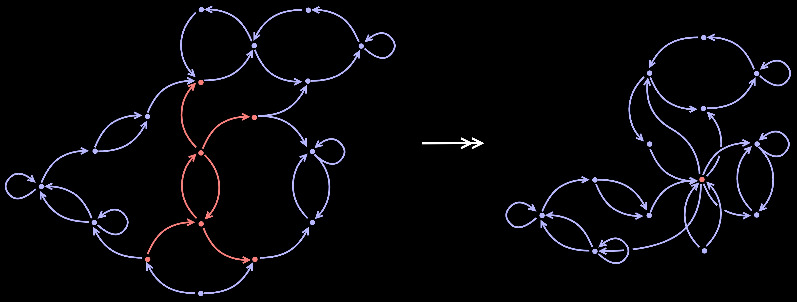

  <picture>
    <source srcset="docs/images/catquot_logo_dark.jpg" media="(prefers-color-scheme: dark)">
    <source srcset="docs/images/catquot_logo_light.jpg" media="(prefers-color-scheme: light)">
    
  </picture>

# CatQuot: Graph ML as Categorical ML
Package for HNSW-style searching in Haskell categories using a tower of quotient categories. Inspired by Abdul Malik's PhD thesis.

# TODOs
- Build `QuotTower` subpackage.
  - Build single level-to-level quotienting $\mathbf{Hask}_{tot}$-module
  - Build full tower $\mathbf{Hask}_{tot}$-module
- Write `QuotTower` message-passing $\mathbf{Kl}_{IO}$-module
  - [...]
- Set up backprop-based optimazation $\mathbf{Kl}_{IO}$-module
  - I suspect there's a general template for this. Find it.
- Add more details to this `README.md`
  - Describe central abstraction in `QuotTower` a bit.
  - Add discussion of relationship to k-WL in `README.md`. 

# Features
## Categorical Message Passing
[...]
### Graphs, Diagrams, and Categories
[...]
## Hierarchical Navigable Small *Message Passing*
[...]
### Quotient graphs
[...]

  <picture>
    <source srcset="docs/images/quotient_graph_dark.jpg" media="(prefers-color-scheme: dark)">
    <source srcset="docs/images/quotient_graph_light.jpg" media="(prefers-color-scheme: light)">
    
  </picture>

  Obtaining a quotient graph by contracting a subgraph

[...]

### Quotients of message-passing networks

[...]

$$X:\ G_0\longrightarrow \mathbb{R}^{d}$$

[...]

$$q:\ G_{\ast}\longrightarrow H_\ast$$

[...]

$$q_{\ast}X:\ H_0\longrightarrow\mathbb{R}^d$$

[...]

$$(q_{\ast}X)_{v} = \int_{q^{-1}(v)} \psi_u(X_{u})\,du$$

[...]

$$(q_{\ast}X)_{v}=\frac{1}{\left|q^{-1}(v)\right|}\!\sum_{u\in q^{-1}(v)}\psi_{u}(X_{u})$$

One major simplifiying assumption we can make is to use the same $\psi_u$ for all $u\in q^{-1}(v)$. In this case, we get a sinle transformation matrix $\psi_{v}$ that transforms the an aggregate of all features in $q^{-1}(v)$:

$$(q_{\ast} X)_v\ \ =\ \ \psi_{v}\left(\frac{1}{\ \ \!\left|q^{-1}(v)\right|\ \ \!}\sum_{u\in q^{-1}(v)}\!\!X_u\ \right)$$

[...]

$$\phi_{u,v}:\mathbb{R}^{d}\longrightarrow\mathbb{R}^{d}$$

taking $X_{u}\mapsto X_{v}$

[...]

$$q_{\ast}\phi_{q(u),q(v)}\ \ =\!\!\sum_{\phi\in G_{1}(u,v)}\!\!\phi_{u,v}$$

[...]
### "Graph U-Nets"
[...]

  <picture>
    <source srcset="docs/images/graph_unet_dark.jpg" media="(prefers-color-scheme: dark)">
    <source srcset="docs/images/graph_unet_light.jpg" media="(prefers-color-scheme: light)">
    
  </picture>

  "Graph U-Net"

### Relationship to Higher-Order Weisfeiler-Leman (*k*-WL) Algorithms
[...]

## Quotient-Based, Hierarchical Category/Graph Searching
[...]
### Search
[...]
### Simplicial Set Builder
[...]